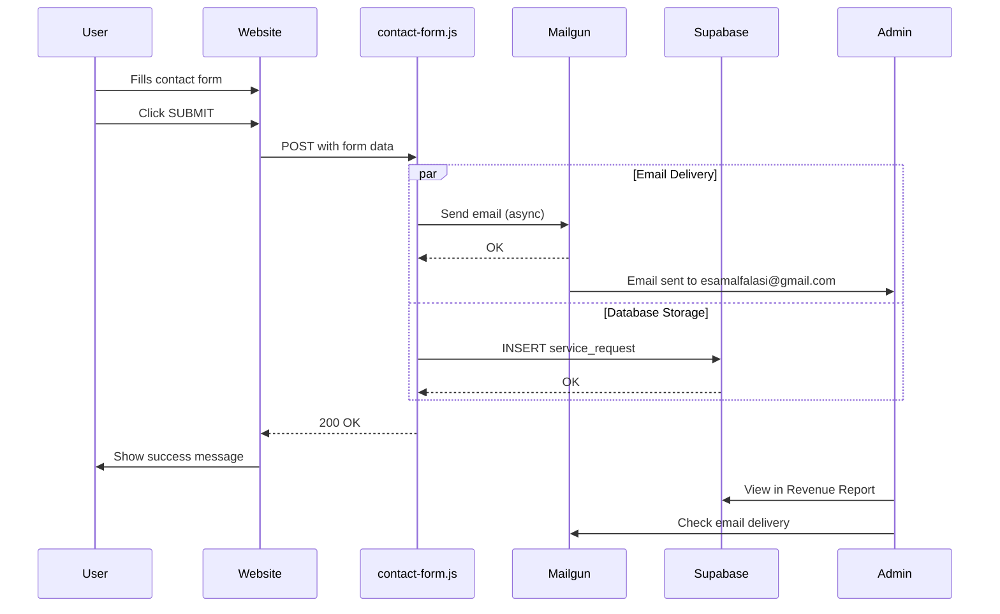
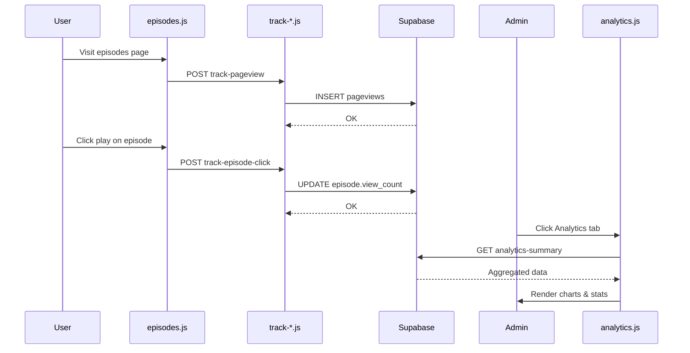
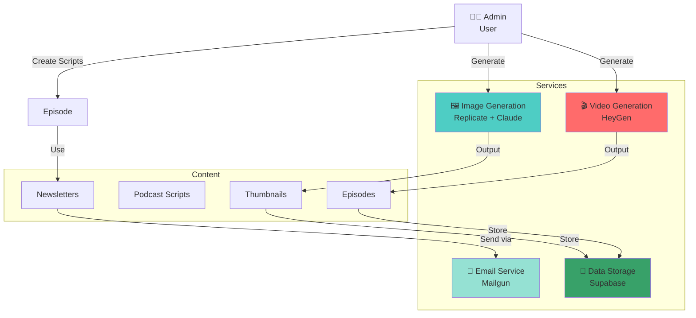
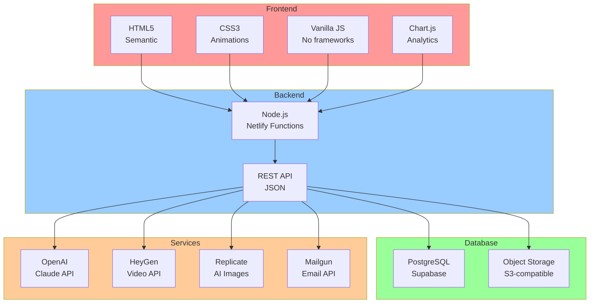
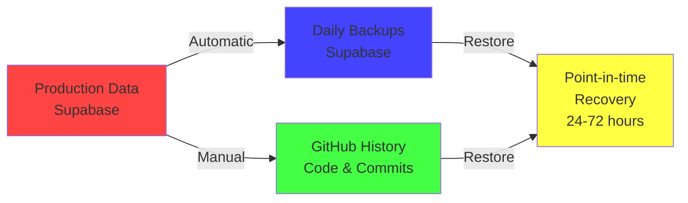

# Dr. Esam Podcast - Architecture Diagram (Visual)

## System Architecture Diagram

```mermaid
graph TB
    subgraph Frontend["🎨 Frontend Layer"]
        PubWeb["📱 Public Website<br/>dreampodcast.com<br/>episodes.js<br/>script.js<br/>style.css"]
        Admin["🛠️ Admin Dashboard<br/>dreampodcast.com/admin<br/>admin.js<br/>admin.css"]
    end

    subgraph Netlify["⚡ Netlify Functions<br/>(Serverless Backend)"]
        subgraph Read["Read Operations"]
            EpList["episode-list.js"]
            SubList["subscriber-list.js"]
            AnalyticsSum["analytics-summary.js"]
            ServiceReq["service-requests.js"]
        end
        
        subgraph Write["Write Operations"]
            EpCreate["episode-create.js"]
            EpDelete["episode-delete.js"]
            ContactForm["contact-form.js"]
            SubCreate["subscriber-create.js"]
        end
        
        subgraph Track["Tracking"]
            TrackPV["track-pageview.js"]
            TrackClick["track-episode-click.js"]
        end
        
        subgraph AI["AI/Generation"]
            GenDialogue["generate-dialogue.js"]
            GenImage["generate-image.js"]
            HeyGen["heygen-create-video.js"]
        end
    end

    subgraph Supabase["🗄️ Supabase"]
        subgraph DB["PostgreSQL Database"]
            Episodes["episodes<br/>id, title, image_url<br/>guest_name, description<br/>youtube, tiktok, view_count"]
            Subscribers["subscribers<br/>id, email, name<br/>country, subscribed_at"]
            ServiceReqs["service_requests<br/>id, service_key<br/>revenue, cost<br/>first_name, email, etc"]
            Pageviews["pageviews<br/>id, page<br/>visited_at"]
            Contacts["contacts<br/>id, name, email<br/>subject, message"]
        end
        
        subgraph Storage["📦 Storage (S3)"]
            EpImages["episode-images/<br/>2025 Insights.jpg<br/>AI Leadership.jpg<br/>..."]
            GenVids["generated-videos/<br/>HeyGen outputs"]
            Uploads["uploads/<br/>user files"]
        end
    end

    subgraph External["🌐 External APIs"]
        Mailgun["📧 Mailgun<br/>Email Delivery<br/>Tracking"]
        HeyGenAPI["🎬 HeyGen API<br/>Video Generation<br/>Avatar Videos"]
        Replicate["🤖 Replicate AI<br/>Image Generation<br/>SDXL Model"]
        Claude["🧠 Claude API<br/>Dialogue Generation<br/>Script Writing"]
    end

    subgraph Social["📱 Social Platforms"]
        YouTube["▶️ YouTube"]
        TikTok["🎵 TikTok"]
        Spotify["🎵 Spotify"]
        Instagram["📸 Instagram"]
        Apple["🎙️ Apple Podcasts"]
    end

    %% Frontend to Netlify
    PubWeb -->|episode-list| EpList
    PubWeb -->|track-pageview| TrackPV
    PubWeb -->|track-episode-click| TrackClick
    PubWeb -->|contact form| ContactForm
    
    Admin -->|CRUD episodes| EpCreate
    Admin -->|episode queries| EpList
    Admin -->|delete episode| EpDelete
    Admin -->|subscriber list| SubList
    Admin -->|analytics| AnalyticsSum
    Admin -->|revenue data| ServiceReq
    Admin -->|create subscriber| SubCreate
    Admin -->|generate video| HeyGen
    Admin -->|generate image| GenImage
    Admin -->|generate dialogue| GenDialogue

    %% Netlify to Supabase
    EpList -->|SELECT| Episodes
    EpCreate -->|INSERT| Episodes
    EpDelete -->|DELETE| Episodes
    SubList -->|SELECT| Subscribers
    SubCreate -->|INSERT| Subscribers
    TrackClick -->|UPDATE view_count| Episodes
    TrackPV -->|INSERT| Pageviews
    ContactForm -->|INSERT| ServiceReqs
    AnalyticsSum -->|SELECT| Pageviews
    AnalyticsSum -->|SELECT| Subscribers
    AnalyticsSum -->|SELECT| Episodes
    ServiceReq -->|SELECT| ServiceReqs
    ContactForm -->|INSERT| Contacts

    %% Netlify to Supabase Storage
    EpCreate -->|Upload/Reference| EpImages
    HeyGen -->|Store output| GenVids
    GenImage -->|Store output| Uploads

    %% Netlify to External
    ContactForm -->|Send email| Mailgun
    HeyGen -->|API call| HeyGenAPI
    GenImage -->|API call| Replicate
    GenDialogue -->|API call| Claude

    %% Episodes to Social
    Episodes -->|youtube link| YouTube
    Episodes -->|tiktok link| TikTok
    PubWeb -->|Social links| Spotify
    PubWeb -->|Social links| Instagram
    PubWeb -->|Social links| Apple

    %% Styling
    classDef frontend fill:#4A90E2,stroke:#2E5C8A,color:#fff
    classDef netlify fill:#F5A623,stroke:#C67E1A,color:#fff
    classDef supabase fill:#3ECF8E,stroke:#2A9D6F,color:#fff
    classDef external fill:#BD10E0,stroke:#7B0A82,color:#fff
    classDef social fill:#FF6B6B,stroke:#CC5555,color:#fff

    class Frontend frontend
    class Netlify netlify
    class Supabase supabase
    class External external
    class Social social
```

## Data Flow: Contact Form Submission

## Data Flow: Episode Analytics

## Deployment Flow

```mermaid
graph LR
    Dev["💻 Developer<br/>Local Machine"]
    Git["🔀 GitHub<br/>clean-main branch"]
    Netlify["🚀 Netlify<br/>Build & Deploy"]
    CDN["🌍 CDN<br/>Global Edge"]
    Live["✨ Live Site<br/>dreampodcast.com"]
    
    Dev -->|git push| Git
    Git -->|webhook| Netlify
    Netlify -->|build static| CDN
    Netlify -->|bundle functions| CDN
    CDN -->|serve| Live
    
    style Dev fill:#4A90E2
    style Git fill:#333
    style Netlify fill:#F5A623
    style CDN fill:#3ECF8E
    style Live fill:#2ECC71
```

## Service Integration Map

## Technology Stack Summary

## Key Metrics & Performance

| Metric | Target | Status |
|--------|--------|--------|
| **Page Load** | < 3s (mobile) | ✅ Optimized |
| **API Response** | < 500ms | ✅ Serverless |
| **Database Queries** | < 100ms | ✅ Indexed |
| **Email Delivery** | < 5min | ✅ Mailgun |
| **CDN Cache Hit** | > 95% | ✅ Netlify |
| **Uptime** | > 99.9% | ✅ Enterprise SLA |

## Backup & Disaster Recovery

---

**Generated:** 2026-04-12  
**Last Updated:** During current session  
**Architecture Type:** Serverless + SaaS  
**Cost Model:** Pay-as-you-go with monthly caps
